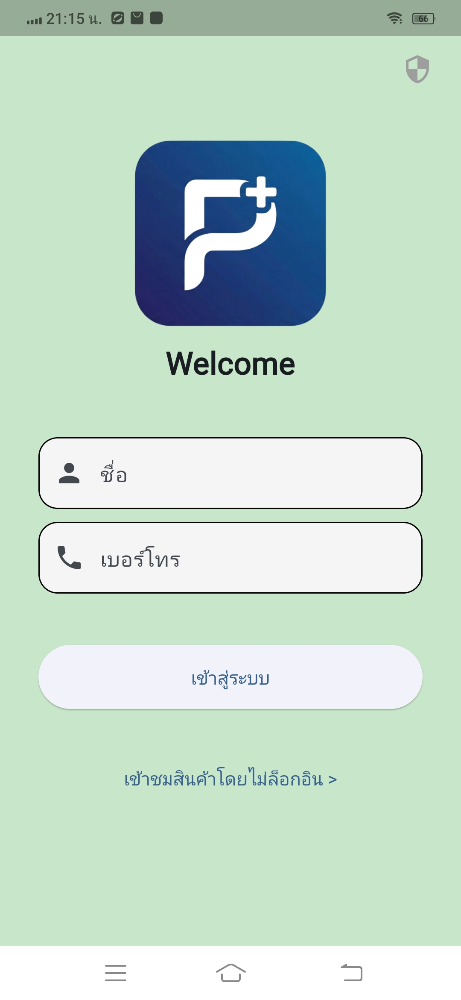
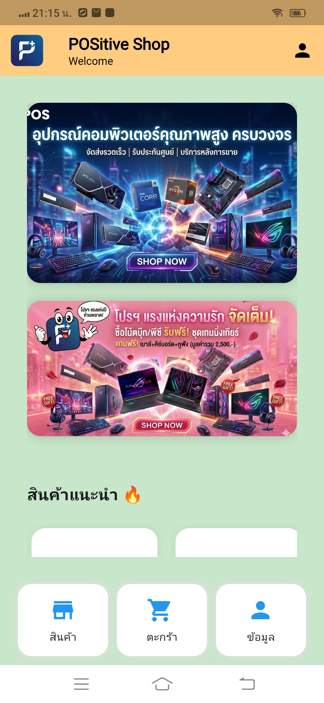
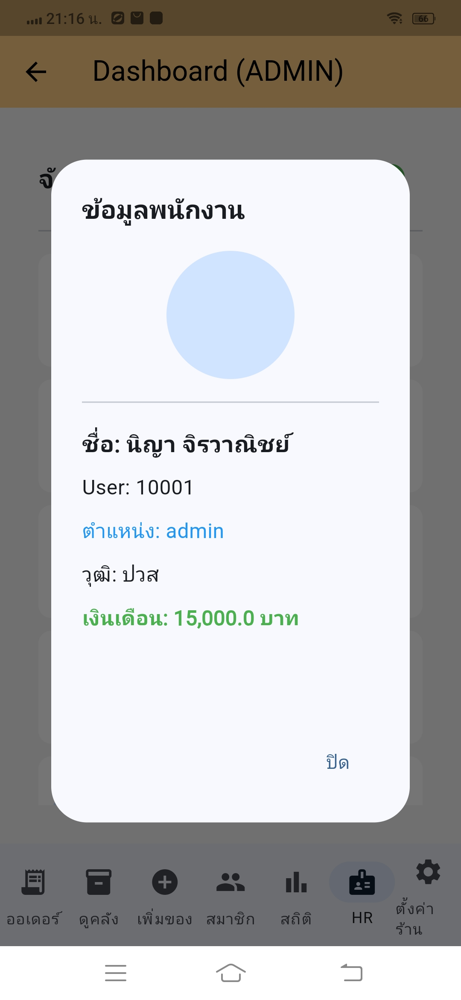
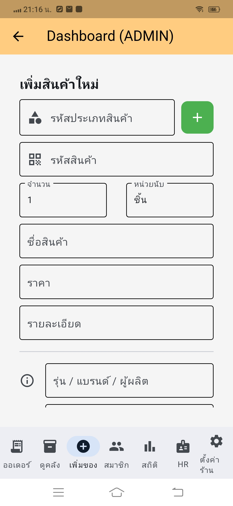
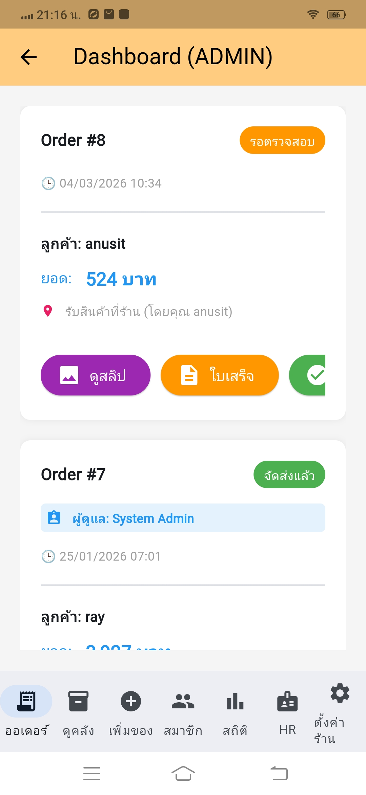

# 🏪 POSitive Shop Manager & Delivery (Full Stack Application)

**POSitive Shop Manager** คือระบบบริหารจัดการหน้าร้าน (Point of Sale) และการจัดส่งสินค้าแบบครบวงจร ที่ถูกออกแบบมาเพื่อแก้ปัญหาการจัดการคลังสินค้า การคำนวณค่าจัดส่งที่ซับซ้อน และการดูยอดขายแบบ Real-time โปรเจกต์นี้แสดงให้เห็นถึงความเข้าใจในการออกแบบสถาปัตยกรรมซอฟต์แวร์แบบ Client-Server อย่างเป็นระบบ## หน้าตาแอปพลิเคชัน (Screenshots)

# POSitive Shop Manager 🚀

แอปพลิเคชันบริหารจัดการระบบคลังสินค้าและจุดขาย (Point of Sale) พัฒนาหลังบ้านด้วย Python, Flask และ SQLite

---

## ส่วนการแสดงผลแอปพลิเคชัน (App Demonstration)

เพื่อแสดงให้เห็นถึงการทำงานจริงของแอปพลิเคชัน กระผมได้จัดเตรียมภาพหน้าจอ (Screenshots) ในฟังก์ชันหลักต่าง ๆ ดังนี้ครับ:

### 1. หน้าจอเข้าสู่ระบบและต้อนรับ (Login & Welcome)

> **อธิบาย:** หน้าจอเริ่มต้นสำหรับการยืนยันตัวตน มีโลโก้แอปพลิเคชันและฟิลด์กรอกข้อมูลที่ออกแบบให้สะอาดตาและง่ายต่อการใช้งาน

### 2. หน้าจอแดชบอร์ดหลัก (Dashboard)

> **อธิบาย:** ศูนย์กลางการแสดงผลข้อมูลสำคัญของร้านค้า มีการจัดเรียงแดชบอร์ดและเมนูหลักที่ชัดเจน เพื่อให้ผู้บริหารมองเห็นภาพรวมของธุรกิจได้ทันที

### 3. ระบบบริหารจัดการข้อมูลพนักงาน (Human Resources)

> **อธิบาย:** ส่วนสำคัญสำหรับการจัดการข้อมูลพนักงาน ปวส. โดยสามารถตรวจสอบข้อมูลพื้นฐาน การเริ่มงาน และการสแกนใบหน้าเพื่อลงเวลาทำงาน

### 4. ระบบเพิ่มและจัดการสินค้าในคลัง (Product Management)

> **อธิบาย:** ฟังก์ชันหลักสำหรับการจัดการสินค้า รองรับการเพิ่มสินค้าใหม่ การกำหนดรหัสสินค้า บาร์โค้ด ราคา และหมวดหมู่ พร้อมแสดงผลรายการสินค้าที่มีอยู่

### 5. ระบบบริหารจัดการออเดอร์และการขาย (Order & Sale Management)

> **อธิบาย:** ส่วนควบคุมออเดอร์การขาย แสดงข้อมูลคำสั่งซื้อแต่ละรายการ พร้อมสถานะและยอดรวมเงิน เพื่อความถูกต้องและรวดเร็วในการให้บริการลูกค้า

---

*(กระผมได้พัฒนาลอจิกการทำงานหลังบ้านทั้งหมดด้วยภาษา Python และ Flask เชื่อมโยงฐานข้อมูล SQLite ด้วยตนเองครับ)*


---

## 📱 ลองใช้งานแอปพลิเคชัน (Try it out!)
คุณสามารถดาวน์โหลดแอปพลิเคชันเวอร์ชัน Android ไปทดลองติดตั้งและใช้งานได้ทันที:
[](https://github.com/anusit-ops/positive-shop-manager/releases/download/v1.0.0/POS_test.apk)

---

## 🚀 ฟีเจอร์เด่น (Key Features)
โปรเจกต์นี้เป็นการพัฒนาระบบแบบ Full Stack ครอบคลุมการทำงานตั้งแต่หน้าบ้าน (Client) ไปจนถึงหลังบ้าน (Server):

### ⚙️ Backend (API & Database) - `server.py`
* **RESTful API Architecture:** พัฒนาด้วย Flask Framework โดยแยก Endpoint อย่างเป็นระเบียบ รองรับการทำ CRUD Operations (Create, Read, Update, Delete) สำหรับสินค้า, คำสั่งซื้อ และผู้ใช้งาน
* **Relational Database:** ออกแบบฐานข้อมูลด้วย SQLite มีการจัดการความสัมพันธ์ของตาราง (เช่น การ JOIN ข้อมูล Order และ Products) พร้อมระบบตัดสต็อกอัตโนมัติ
* **Secure File Handling:** ระบบจัดการการอัปโหลดไฟล์รูปภาพสินค้าและสลิปโอนเงิน โดยแยกเก็บใน Local Storage อย่างเป็นสัดส่วน
* **Dynamic Configuration:** ระบบตั้งค่าร้านค้าแบบยืดหยุ่น สามารถเปลี่ยนธีมสี โลโก้ และเรทค่าจัดส่งจากหน้า Admin โดยดึงข้อมูลจาก Database แบบ Real-time

### 🎨 Frontend (UI & UX) - `main.py`
* **Cross-Platform UI:** พัฒนาส่วนแสดงผลด้วย Flet Framework ทำให้โค้ดชุดเดียวสามารถรันได้ทั้งบน Web, Desktop และ Mobile
* **Role-Based Access Control (RBAC):** ระบบจำกัดสิทธิ์ผู้ใช้งานที่รัดกุม แบ่งเป็นระดับ Admin, Manager, HR, Staff และ Customer โดยแต่ละสิทธิ์จะเห็นเมนูการทำงานที่แตกต่างกัน
* **Smart Shipping Algorithm:** โลจิกคำนวณค่าจัดส่งอัตโนมัติสุดอัจฉริยะ อ้างอิงจากรหัสไปรษณีย์ปลายทาง ผสมผสานกับน้ำหนักและขนาดของสินค้า (Size S, M, L, XL และหมวดหมู่พิเศษ)
* **Interactive Dashboard:** หน้าต่างสรุปสถิติยอดขาย (Sales Analytics) ที่เข้าใจง่าย สำหรับผู้บริหาร

---

## 🛠 วิธีการติดตั้งและรันโปรเจกต์ (Installation Guide)
สำหรับผู้ที่ต้องการนำ Source Code ไปรันบนเครื่อง Local:

1. **Clone repository:**
   ```bash
   git clone [https://github.com/anusit-ops/positive-shop-manager.git](https://github.com/anusit-ops/positive-shop-manager.git)
   cd positive-shop-manager
